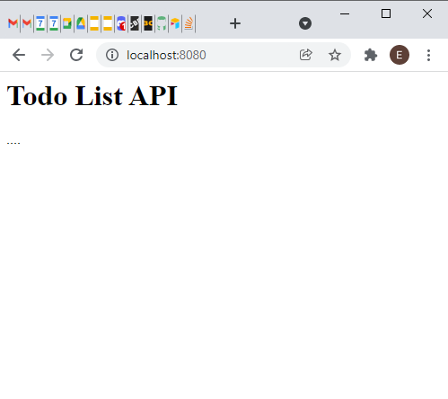

# Node.js Assessment: Todo List API

For your unit 5 assessment you are required to create a RESTful API  using [Node.js](https://nodejs.org/en/) and [Express.js](https://expressjs.com/).

The API should create `(POST)`, read `(GET)`, update `(PUT or PATCH)` and delete `(DELETE)` from a list of todos. The [todos.json](src/models/todos.json) file is used as the server's data store and can be found in the `models` folder.

Run through the [Setup and Configuration](#setup-and-configuration) steps to configure your API before you start developing.

Ensure your finished repository meets all of the [Assessment Criteria](#assessment-criteria) listed below

## Assessment Criteria

1. The root URL should serve/return the file `index.html`. The `index.html` file should outline the expected endpoints for the service.

1. The `index.html` file should reference a `favicon.ico`, `logo.png` and a `styles.css` file.

1. Add a `<title>` tag that includes your name e.g. Welcome to `Monica's` Todo List API

1. Include the table of endpoints below in your homepage (`index.html`) as a description of how to consume (use) your API.

1. Add the functionality for all the endpoints described below to your API:

| Method | URL | Description | Example URL | Request Body | Status Code | Response Body |
|---|---|---|---|---|---|---|
| `GET` | `/`| Returns a static HTML file `index.html` containing a `favicon.ico`, `logo.png` and reference to an external stylesheet `styles.css`. | `http://localhost:8080/` | | 200 | HTML page|
|` GET` | `/todos` | Return all todos from the `todos.json` file  | `http://localhost:8080/todos` | | 200 | `[{"id":"01507581-9d12-4c3a-bb60-19d539a11189","name":"Learn to use Adobe Photoshop","created":"2021-11-20T18:25:43.511Z","due":"2021-12-23T23:05:03.352Z","completed":false}, {...}, {...} ]` |
| `GET` | `/todos/:id` | Return a specific todo with the corresponding `id` | `http://localhost:8080/todos/01507581-9d12-4c3a-bb60-19d539a11189` | | 200 or 404 if id not found | `{"id":"01507581-9d12-4c3a-bb60-19d539a11189","name":"Learn to use Adobe Photoshop","created":"2021-11-20T18:25:43.511Z","due":"2021-12-23T23:05:03.352Z","completed":false}` |
| `GET` | `/todos/overdue` | Return a list of __overdue__ todos or an empty list if there are no overdue todos. Todos can be filtered based on their `due` date attribute |`http://localhost:8080/todos/overdue` | | 200 |`[]` or `[{todo1},{todo2},{...}]` |
| `GET` | `/todos/completed` | Return a list of __completed__ todos or an empty list, if no todos have been completed. Todos can be filtered based on their `due` date attribute. | `http://localhost:8080/todos/completed` | | 200 | `[]` or `[{todo1},{todo2},{...}]` |
| `POST`* | `/todos` | Add a new todo to the todo list | `http://localhost:8080/todos` | `{'name' : 'Buy oatmilk x 2', 'due':'2021-11-20T18:25:43.511Z'}` | 201 (Created), 400 if incorrect data submitted| |
| `PATCH`* | `/todos/:id` | Edit the `name` and/or `due` date attributes of a todo.  | `http://localhost:8080/todos/:9d127581-0150-4c3a-bb60-1118919d539a` | `{"name":"Buy 3 Cartons of Oat Milk","due":"2021-12-23T18:25:43.511Z"}` | 200 (OK) or 400 (Bad Request) if invalid id or request attributes |  | `http://localhost:8080/todos/01507581-9d12-4c3a-bb60-19d539a11189` | | 200 | |
| `POST`* | `/todos/:id/complete` | Update todo, set attribute complete to `true` | `http://localhost:8080/todos/01507581-9d12-4c3a-bb60-19d539a11189/complete` | | 200 (OK) or 400 (Bad Request) if invalid id | |
| `POST`* | `/todos/:id/undo` | Update todo, set attribute complete to `false` |`http://localhost:8080/todos/01507581-9d12-4c3a-bb60-19d539a11189/undo` | | 200 (OK) or 400 (Bad Request) if invalid id | |
| `DELETE`* | `todos/:id` | Deletes a todo by `id` |`http://localhost:8080/todos/01507581-9d12-4c3a-bb60-19d539a11189` | | 200 (OK) or 400 (Bad Request) if invalid id | |

*_`POST`, `PUT`, `PATCH` and `DELETE` methods may need an API testing tool such as Postman to test._

## Expected Structure of a Todo

```json
  {
    "id":"01507581-9d12-4c3a-bb60-19d539a11189",
    "name":"Learn to use Adobe Photoshop",
    "created":"2021-11-20T18:25:43.511Z",
    "due":"2021-12-23T23:05:03.352Z",
    "completed":false
  }
```

## Setup and Configuration

1. Clone this repository to your local machine. Once cloned, open in Visual Code.

2. Create a file called `.env` in your home directory (outside of the `src` folder). Add the following text:

```
BASE_JSON_PATH="/models/todos.json"
```

This will ensure the current starter code is using the `todos.json` in the `models` folder.

In your code when saving the updated list of todos back to the `todos.json` file, use the following environment variable:

```javascript
process.env.BASE_JSON_PATH
```
e.g.
```javascript
fs.writeFile(__dirname + process.env.BASE_JSON_PATH,  content, err => {
    if (err) {
      console.error(err)
      return
    }
}
```

3. Run the following commands to install any dependencies:

```
npm install
```

4. In the `index.js` file you will find some initial code. Read through, understand and uncomment the code to implement a basic static server with two endpoints.

1. Once you have completed the steps above. You can start the API with the following command:

```
npm start
```

6. If configured correctly, when you visit the local URL: `http://localhost:8080/`, you will see the following page:



7. To complete the assessment make additions to the `index.js` file to return the expected data. Review the assessment criteria for detailed information on expected endpoints for your completed API.

## How to submit

Commit all files and folders to the repo and push to your remote repo for assessment.


